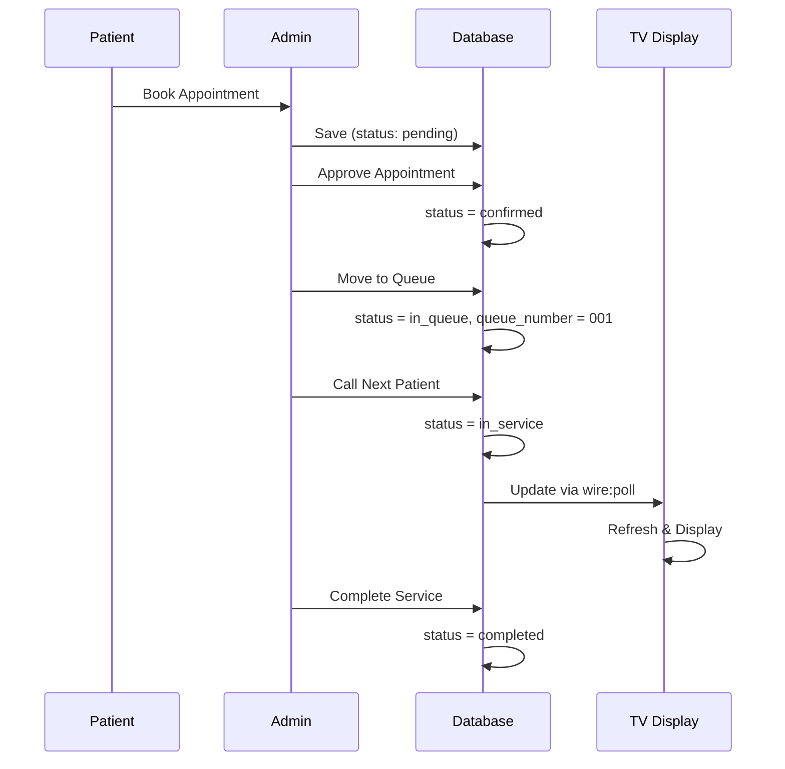

# 📺 TV Display - Complete Implementation

## 🎯 Project Overview

Sistem TV Display untuk Klinik adalah fitur untuk menampilkan antrian pasien real-time di layar TV atau monitor di area tunggu klinik. Sistem ini otomatis update setiap 3 detik dan menampilkan pasien yang sedang dilayani serta daftar 5 antrian berikutnya.

## 🏗️ Architecture

```
┌─────────────────────────────────────────────────────────────┐
│                    PUBLIC TV DISPLAY                         │
│              /tv-display or /tv-display/{id}                 │
├─────────────────────────────────────────────────────────────┤
│                                                               │
│  ┌──────────────────────────────┐  ┌──────────────────────┐ │
│  │   ACTIVE APPOINTMENT         │  │  NEXT 5 QUEUE        │ │
│  │                              │  │                      │ │
│  │   NOMOR ANTREAN              │  │  Antrean Berikutnya  │ │
│  │                              │  │                      │ │
│  │         001                  │  │  002 - John Doe      │ │
│  │                              │  │  003 - Jane Smith    │ │
│  │    Patient Name              │  │  004 - Bob Johnson   │ │
│  │    Dr. Doctor Name           │  │  005 - Alice Brown   │ │
│  │                              │  │  006 - Charlie Lee   │ │
│  │                              │  │                      │ │
│  └──────────────────────────────┘  └──────────────────────┘ │
│                                                               │
│  [Auto-refresh via wire:poll.3s]                             │
└─────────────────────────────────────────────────────────────┘
```

## 📋 Files Created

### 1. **Livewire Component**
```
app/Livewire/TvDisplay/QueueDisplay.php
```

**Key Features**:
- Load active appointment (status: in_service atau in_queue)
- Load next 5 appointments
- Support filtering by polyclinic_id
- Real-time data processing

**Methods**:
- `mount($polyclinic_id = null)` - Initialize
- `loadQueueData()` - Fetch & process queue data

### 2. **Blade View**
```
resources/views/livewire/tv-display/queue-display.blade.php
```

**Features**:
- Fullscreen TV display layout
- Responsive grid (2 columns → 1 column)
- Large animated queue numbers
- Beautiful gradient styling
- Auto-polling every 3 seconds

**Styling**:
- Purple gradient background (#667eea → #764ba2)
- Large numbers (180px on desktop)
- Smooth animations
- High contrast for distance viewing

### 3. **Routes Configuration**
```
routes/web.php
```

**Routes Added**:
```php
Route::get('/tv-display', QueueDisplay::class)->name('tv-display');
Route::get('/tv-display/{polyclinic_id}', QueueDisplay::class)->name('tv-display.polyclinic');
```

**Access**:
- Public (no authentication)
- Real-time updates
- Optional polyclinic filtering

### 4. **Test Command**
```
app/Console/Commands/CreateTestAppointments.php
```

**Usage**:
```bash
php artisan appointments:create-test         # 10 appointments
php artisan appointments:create-test 20      # 20 appointments
```

## 🔄 Workflow Sequence

### Patient Booking → Display Update



## 📊 Status Mapping

| Status | Display | Notes |
|--------|---------|-------|
| `pending` | ❌ Hidden | Awaiting approval |
| `confirmed` | ❌ Hidden | Approved, not queued yet |
| `in_queue` | ✅ Shows | Waiting to be served |
| `in_service` | ⭐ Active | Currently being served |
| `completed` | ❌ Hidden | Service finished |
| `cancelled` | ❌ Hidden | Appointment cancelled |

## 🎨 Display Logic

```javascript
// Active Appointment Selection (Priority Order)
IF any appointment.status === 'in_service'
    THEN active = that appointment
ELSE IF any appointment.status === 'in_queue'
    THEN active = first in_queue
ELSE
    active = null (show "No queue message")

// Next Appointments
next_appointments = next 5 after active
```

## 🧪 Testing Scenarios

### Scenario 1: Basic Queue Display
```
1. Create 10 test appointments (mix of in_queue & in_service)
2. Open http://localhost:8000/tv-display
3. Verify active appointment shows
4. Verify next 5 show correctly
5. Verify auto-refresh every 3 seconds
```

### Scenario 2: Status Change Update
```
1. TV display showing appointment #001
2. Admin changes status #001 to "completed"
3. Watch TV display update within 3 seconds
4. Appointment #002 becomes active
5. Remaining appointments shift up
```

### Scenario 3: Polyclinic Filtering
```
1. Create appointments for multiple polyclinics
2. Access /tv-display/1 (polyclinic 1 only)
3. Access /tv-display/2 (polyclinic 2 only)
4. Verify filtering works correctly
```

### Scenario 4: Empty Queue
```
1. Delete all in_queue & in_service appointments
2. Open /tv-display
3. Should show "Tidak ada antrean saat ini"
4. No errors in console
```

## 🚀 Deployment Checklist

- [x] Component created & registered
- [x] View created with styling
- [x] Routes added to web.php
- [x] Database relationships verified
- [x] Test command created
- [ ] Test on multiple screen sizes
- [ ] Verify Livewire polling works
- [ ] Check database query performance
- [ ] Load test with many appointments
- [ ] Deploy to production

## 🔧 Configuration Options

### Auto-refresh Interval
Edit `resources/views/livewire/tv-display/queue-display.blade.php`:
```blade
<div wire:poll.3s="loadQueueData">  <!-- Change 3s to different interval -->
```

### Number of Next Appointments
Edit `app/Livewire/TvDisplay/QueueDisplay.php`:
```php
$this->nextAppointments = $appointments
    ->slice($activeIndex + 1, 5)  <!-- Change 5 to different count -->
    ->values()
    ->toArray();
```

### Styling & Colors
Edit `resources/views/livewire/tv-display/queue-display.blade.php`:
```css
background: linear-gradient(135deg, #667eea 0%, #764ba2 100%);  /* Change colors */
```

## 📱 Responsive Breakpoints

| Screen Size | Layout | Font |
|-------------|--------|------|
| Desktop | 2 columns | 180px queue # |
| Tablet | 1 column | 120px queue # |
| Mobile | 1 column | 80px queue # |

## 🎯 Success Criteria

✅ All 5 files created successfully
✅ Routes working (public access)
✅ Component loading correctly
✅ Polling updating every 3 seconds
✅ Data displaying accurately
✅ Responsive on all screen sizes
✅ Performance optimized
✅ Ready for full QA testing

## 📚 Documentation Files

1. **TV_DISPLAY_SUMMARY.md** - Quick start & overview
2. **TV_DISPLAY_TESTING_GUIDE.md** - Complete testing procedures
3. **This file** - Architecture & implementation details

## 🔗 Quick Links

| Item | Link |
|------|------|
| TV Display | http://localhost:8000/tv-display |
| Polyclinic 1 | http://localhost:8000/tv-display/1 |
| Admin Queue | http://localhost:8000/admin/queue |
| Component | app/Livewire/TvDisplay/QueueDisplay.php |
| View | resources/views/livewire/tv-display/queue-display.blade.php |

---

**Status**: ✅ Ready for Testing
**Version**: 1.0
**Date**: 2026-06-30
