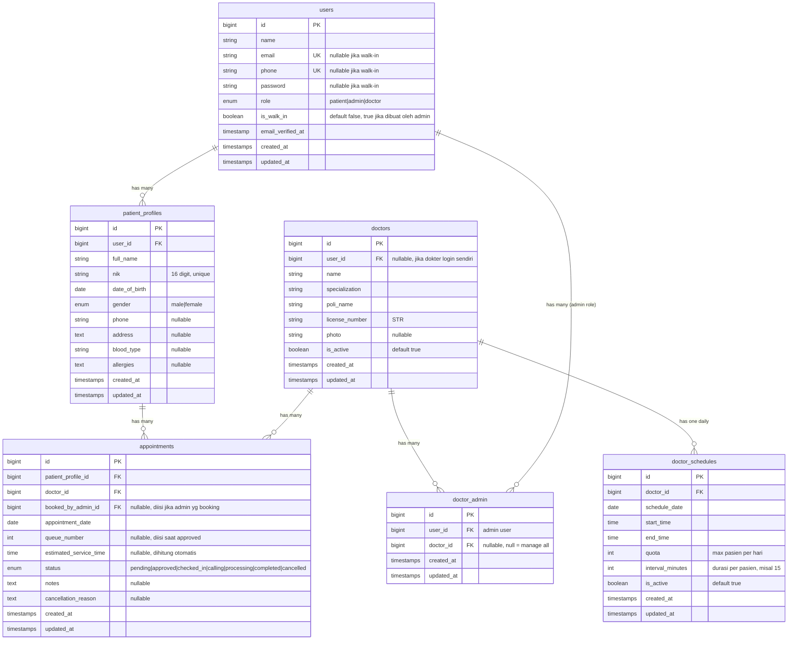
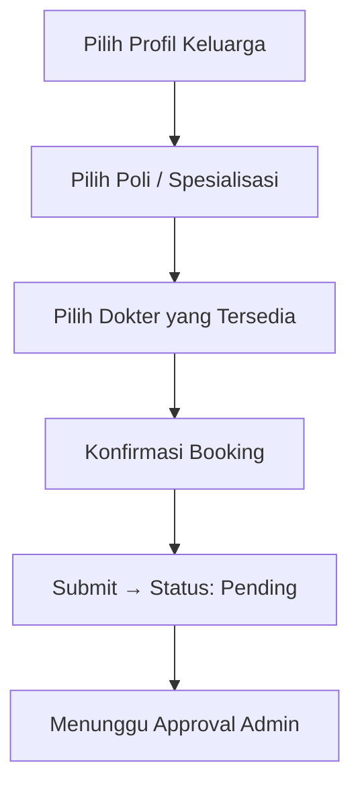
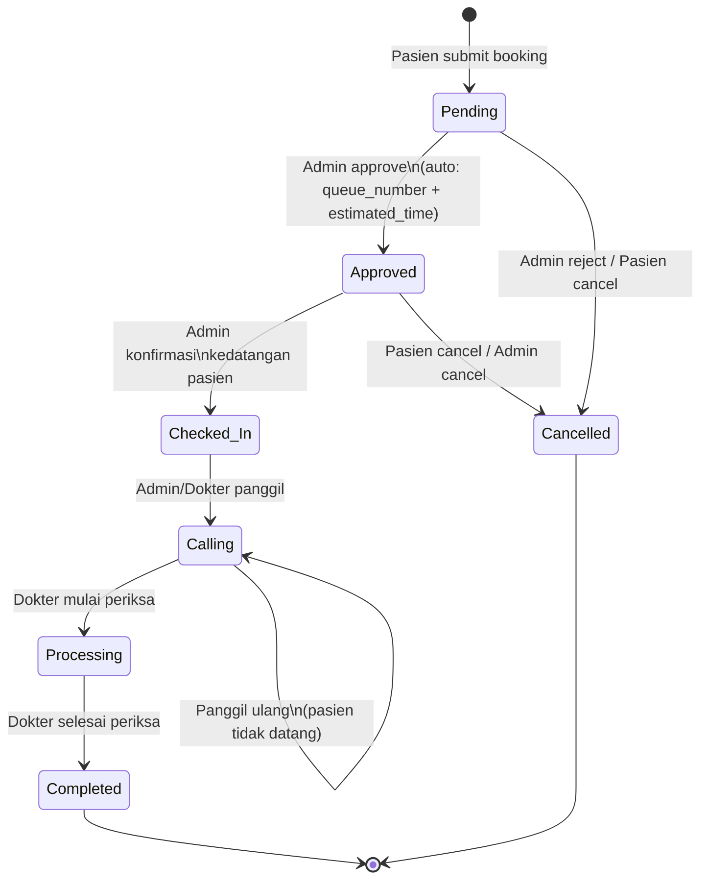

# 📋 Product Requirements Document (PRD)
# Aplikasi Manajemen Klinik Multi-Spesialis — Mobile-First Web App

---

## 1. Ringkasan Eksekutif

### 1.1 Nama Produk
**KlinikQ** — Mobile-First Multi-Specialist Clinic Management Web Application

### 1.2 Deskripsi Singkat
Aplikasi web berbasis Laravel, Livewire, dan Tailwind CSS untuk mengelola operasional klinik multi-spesialis. Aplikasi ini dirancang **mobile-first** dengan fokus pada kemudahan penggunaan via sentuhan jempol (*thumb-driven*), mendukung manajemen antrian real-time, booking janji temu, dan tampilan TV display untuk panggilan pasien.

### 1.3 Masalah yang Diselesaikan

| Masalah | Solusi |
|---------|--------|
| Pasien harus datang pagi-pagi dan mengantre manual | Booking online hari-H, estimasi waktu layanan otomatis |
| Satu akun hanya untuk satu orang | Satu akun bisa kelola banyak profil keluarga (anak, lansia) |
| Admin kesulitan mengelola kuota & jadwal dokter | Konfigurasi kuota harian & interval layanan per dokter |
| Tidak ada informasi antrian real-time di ruang tunggu | TV Display real-time dengan polling otomatis |
| Data rekam medis tercampur antar anggota keluarga | Rekam medis terikat ke `patient_profile_id`, bukan `user_id` |

### 1.4 Target Pengguna
- **Pasien & Keluarga** — Orang tua yang mengelola janji temu anak/anggota keluarga
- **Admin Klinik** — Staff administrasi yang mengelola antrian dan jadwal dokter
- **Dokter** — Praktisi medis yang melihat daftar pasien hari ini
- **TV Display** — Layar di ruang tunggu untuk menampilkan nomor antrian

### 1.5 Bahasa
- **Kode sumber & database**: Bahasa Inggris
- **UI/Label/Tampilan**: Bahasa Indonesia (target pengguna orang Indonesia)

---

## 2. Tech Stack & Arsitektur

### 2.1 Technology Stack

| Layer | Teknologi |
|-------|-----------|
| **Backend Framework** | Laravel 12 (latest) |
| **Frontend Reactivity** | Livewire 3 |
| **CSS Framework** | Tailwind CSS 3 |
| **Database** | MySQL 8 / PostgreSQL 15 |
| **Authentication** | Laravel Breeze (custom) |
| **Real-time (simulated)** | Livewire polling (`wire:poll.3s`) |
| **Server** | PHP 8.4+, Nginx/Apache |

### 2.2 Prinsip Arsitektur

- **Mobile-First Responsive Design** — Desain utama untuk layar < 640px, lalu scale up ke tablet & desktop
- **Custom UI 100%** — Tidak menggunakan Filament atau admin dashboard pre-built
- **Clean Code & DRY** — Reusable Livewire components, Blade partials, dan service classes
- **Separation of Concerns** — Business logic di Service/Action classes, bukan di Controller/Livewire component

---

## 3. Design System & UI/UX Guidelines

### 3.1 Color Palette

| Peran Warna | Nama | Hex Code | Penggunaan |
|-------------|------|----------|------------|
| Canvas/Background | Off-White / Putih Tulang | `#F8F7F3` | Background utama semua halaman |
| Primary | Mint/Teal | `#96E6C2` | Tombol utama, header, navigasi aktif, aksen |
| Urgency | Orange | `#EA580C` | Badge antrian, alert, status mendesak |
| Success/Approved | Amber/Gold | `#FFAA29` | Status disetujui, konfirmasi, badge sukses |
| Text Primary | Dark Charcoal | `#1F2937` | Teks utama / heading |
| Text Secondary | Gray | `#6B7280` | Teks pendukung / subtitle |
| Surface/Card | White | `#FFFFFF` | Card containers, modals |
| Danger | Red | `#DC2626` | Tombol batal, status cancelled |

### 3.2 Typography
- **Font Utama**: Inter (Google Fonts)
- **Heading**: Semi-bold / Bold
- **Body**: Regular (400)
- **Ukuran minimum touch target**: 44px × 44px (WCAG compliance)

### 3.3 Layout Strategy

| Device | Lebar | Layout |
|--------|-------|--------|
| Mobile (Pasien/Admin) | < 768px | Bottom Navigation Bar + Full-width content |
| Tablet (Dokter/Admin) | 768px — 1024px | Side Navigation + Main content area |
| Desktop (Admin/Dokter) | > 1024px | Side Navigation + Expanded workspace |
| TV Display | Fullscreen | Split layout (kiri: nomor aktif, kanan: daftar antrian) |

### 3.4 Navigasi

#### Bottom Navigation Bar (Mobile — Pasien)
```
┌──────────────────────────────────────────┐
│  🏠 Beranda  │  📋 Riwayat  │  👤 Profil │
└──────────────────────────────────────────┘
```

#### Bottom Navigation Bar (Mobile — Admin)
```
┌───────────────────────────────────────────────────┐
│  📥 Antrian  │  ⚙️ Pengaturan  │  👤 Akun        │
└───────────────────────────────────────────────────┘
```

#### Side Navigation (Tablet/Desktop — Dokter)
```
┌─────────────┬────────────────────────────┐
│ Logo        │                            │
│ Dashboard   │     Main Content Area      │
│ Pasien Hari │                            │
│ Ini         │                            │
│ Riwayat     │                            │
│ Profil      │                            │
└─────────────┴────────────────────────────┘
```

---

## 4. Arsitektur Database

### 4.1 Entity Relationship Diagram (ERD)



### 4.2 Aturan Bisnis Database

> [!IMPORTANT]
> **Aturan Kritis**: Semua rekam medis dan appointment HARUS terikat ke `patient_profile_id`, BUKAN `user_id`. Ini memungkinkan satu akun orang tua mengelola riwayat medis independen untuk beberapa anak atau kerabat.

- **Foreign Key Cascading**:
  - `patient_profiles.user_id` → ON DELETE CASCADE
  - `appointments.patient_profile_id` → ON DELETE RESTRICT (jangan hapus profil yang punya appointment)
  - `appointments.doctor_id` → ON DELETE RESTRICT
  - `doctor_admin.user_id` → ON DELETE CASCADE
  - `doctor_admin.doctor_id` → ON DELETE CASCADE
  - `doctor_schedules.doctor_id` → ON DELETE CASCADE

- **Unique Constraints**:
  - `patient_profiles.nik` — UNIQUE
  - `users.email` — UNIQUE
  - `users.phone` — UNIQUE
  - `doctor_schedules` — UNIQUE on (`doctor_id`, `schedule_date`)
  - `appointments` — UNIQUE on (`patient_profile_id`, `doctor_id`, `appointment_date`) → satu profil hanya bisa booking 1x ke dokter yang sama per hari

---

## 5. User Roles & Hak Akses

### 5.1 Definisi Role

| Role | Deskripsi | Akses |
|------|-----------|-------|
| **patient** | Kepala keluarga / pengguna individual | Kelola profil keluarga, booking appointment, lihat riwayat |
| **admin** | Staff administrasi klinik | Kelola antrian, approve/reject booking, konfigurasi jadwal dokter |
| **doctor** | Dokter praktik | Lihat daftar pasien hari ini, update status pasien |

### 5.2 Permission Matrix

| Fitur | Patient | Admin | Doctor |
|-------|:-------:|:-----:|:------:|
| Login/Register | ✅ | ✅ | ✅ |
| Kelola profil keluarga | ✅ | ❌ | ❌ |
| Booking appointment (sendiri) | ✅ | ❌ | ❌ |
| Booking appointment (atas nama pasien walk-in) | ❌ | ✅ | ❌ |
| Lihat riwayat sendiri | ✅ | ❌ | ❌ |
| Lihat daftar antrian | ❌ | ✅ | ✅ |
| Lihat antrian masuk (pending) | ❌ | ✅ | ❌ |
| Approve/Reject booking | ❌ | ✅ | ❌ |
| Konfigurasi jadwal & kuota dokter | ❌ | ✅ | ❌ |
| Panggil pasien (Calling) | ❌ | ✅ | ✅ |
| Update status ke Processing/Completed | ❌ | ❌ | ✅ |
| Lihat daftar pasien hari ini | ❌ | ✅ | ✅ |
| Akses TV Display | 🌐 Public | 🌐 Public | 🌐 Public |

### 5.3 Admin ↔ Doctor Assignment Rules

```
┌─────────────────────────────────────────────────────┐
│ doctor_admin.doctor_id = NULL                       │
│ → Admin ini bisa mengelola SEMUA dokter             │
│                                                     │
│ doctor_admin.doctor_id = 5                          │
│ → Admin ini hanya bisa mengelola Dokter ID 5        │
│                                                     │
│ Satu admin bisa punya banyak record doctor_admin    │
│ → Bisa mengelola beberapa dokter tertentu            │
└─────────────────────────────────────────────────────┘
```

---

## 6. Fitur Detail — Phase 1

### 6.1 Modul Autentikasi

#### 6.1.1 Registrasi Pasien
- **URL**: `/register`
- **Fields**:
  - Nama Lengkap (required, min: 3)
  - Email (required, unique, valid email)
  - No. Telepon (required, unique, format: 08xxxxxxxxxx)
  - Password (required, min: 8, confirmation)
- **Post-Registration**: Redirect ke halaman buat profil pasien pertama
- **UI**: Form sederhana, mobile-friendly, satu kolom

#### 6.1.2 Login
- **URL**: `/login`
- **Fields**: Email/No. Telepon + Password
- **Post-Login Redirect**:
  - Role `patient` → `/patient/dashboard`
  - Role `admin` → `/admin/dashboard`
  - Role `doctor` → `/doctor/dashboard`

#### 6.1.3 Logout
- Destroy session, redirect ke `/login`

---

### 6.2 Panel Pasien (Mobile-First)

#### 6.2.1 Dashboard Pasien
- **URL**: `/patient/dashboard`
- **Layout**: Bottom Navigation Bar (Beranda, Riwayat, Profil)
- **Komponen**:
  1. **Profile Picker (Netflix-Style)**
     - Tampilkan semua `patient_profiles` milik user dalam grid avatar
     - Setiap avatar: inisial nama + warna unik
     - Klik avatar = set profil aktif (simpan di session)
     - Tombol "+" untuk tambah profil baru
  2. **Status Antrian Aktif** (jika ada)
     - Card menampilkan: Nomor antrian, Dokter, Estimasi waktu
     - Warna card mengikuti status (orange = menunggu, hijau = sudah dipanggil)
  3. **Quick Actions**
     - Tombol besar "📅 Daftar Periksa" → ke flow booking
  4. **Info Klinik**
     - Jam operasional, alamat singkat

#### 6.2.2 Profil Keluarga — CRUD
- **URL**: `/patient/profiles`
- **Tambah Profil** (`/patient/profiles/create`):
  - Nama Lengkap (required)
  - NIK (required, 16 digit, unique, validasi format)
  - Tanggal Lahir (required, date picker)
  - Jenis Kelamin (required, pilihan: Laki-laki / Perempuan)
  - No. Telepon (opsional)
  - Alamat (opsional)
  - Golongan Darah (opsional, pilihan: A, B, AB, O)
  - Alergi (opsional, textarea)
- **Edit Profil**: Same form, pre-filled
- **Hapus Profil**: Soft confirmation dialog. Dilarang hapus jika ada appointment aktif.

#### 6.2.3 Booking Appointment (Flow Multi-Step)

**Step-by-step flow:**



**Step 1 — Pilih Profil**
- Tampilkan list profil keluarga (avatar + nama)
- Jika hanya 1 profil, auto-select

**Step 2 — Pilih Poli/Spesialisasi**
- Tampilkan card grid spesialisasi yang tersedia hari ini:
  - 🧒 Anak (Pediatrics)
  - 🤰 Kandungan (Obgyn)
  - 👂 THT (ENT)
  - 🫀 Penyakit Dalam (Internal Medicine)
  - 🧴 Kulit & Kelamin (Dermatology)
- Hanya tampilkan poli yang ada dokter aktif & jadwal hari ini

**Step 3 — Pilih Dokter**
- List dokter di poli tersebut yang buka hari ini
- Info: Nama, foto, sisa kuota hari ini
- Jika kuota penuh → tampilkan badge "Kuota Penuh", disable selection

**Step 4 — Konfirmasi**
- Summary: Profil pasien, Dokter, Tanggal (hari ini)
- Tombol "Daftar Sekarang"

**Validasi**:
- Satu profil hanya bisa booking 1x ke dokter yang sama per hari
- Booking hanya untuk hari ini (Hari-H), tidak bisa booking ke depan di Phase 1
- Kuota dokter belum penuh

#### 6.2.4 Riwayat Appointment
- **URL**: `/patient/history`
- Tampilkan semua appointment untuk SEMUA profil keluarga
- Filter by: Profil, Status, Tanggal
- Card per appointment: Nama pasien, Dokter, Tanggal, Status (badge warna), Nomor antrian

---

### 6.3 Panel Admin (Mobile & Tablet)

#### 6.3.1 Dashboard Admin
- **URL**: `/admin/dashboard`
- **Komponen**:
  1. **Summary Cards**:
     - Jumlah Pending hari ini (orange badge)
     - Jumlah Approved hari ini
     - Jumlah Completed hari ini
     - Total pasien hari ini
  2. **Quick Filter**: Filter by dokter (jika admin mengelola >1 dokter)

#### 6.3.2 Booking oleh Admin (Walk-in / Atas Nama Pasien)

> [!IMPORTANT]
> Fitur ini digunakan untuk pasien yang datang langsung ke klinik dan belum familiar menggunakan aplikasi. Admin membuat booking **atas nama pasien**, namun idealnya pasien tetap diarahkan untuk membuat akun sendiri di kemudian hari.

**URL**: `/admin/walk-in-booking`

**Alur**:
1. Admin mencari pasien berdasarkan NIK atau Nama
   - Jika **ditemukan**: Pilih profil pasien yang sudah ada
   - Jika **belum terdaftar**: Admin buat profil pasien baru (quick form: Nama, NIK, Tanggal Lahir, Jenis Kelamin)
     - Sistem otomatis membuat `user` account placeholder (tanpa password, ditandai `is_walk_in = true`)
     - Pasien bisa klaim akun ini nanti via registrasi dengan NIK yang sama
2. Admin pilih Dokter/Poli yang tersedia hari ini
3. Admin submit booking → Status langsung **Approved** (skip Pending, karena admin yang membuat)
4. Sistem otomatis hitung queue number & estimated time

**Catatan**: Appointment yang dibuat oleh admin ditandai dengan field `booked_by_admin_id` agar bisa dilacak.

---

#### 6.3.3 Manajemen Antrian

**URL**: `/admin/queue`

**Tabs / Filter Status**:
- 📥 Pending (baru masuk, butuh approval)
- ✅ Approved (sudah disetujui, menunggu kedatangan)
- 📍 Checked-In (pasien sudah di klinik)
- 📢 Calling (sedang dipanggil)
- 🔄 Processing (sedang diperiksa)
- ✔️ Completed (selesai)
- ❌ Cancelled (dibatalkan)

**Aksi per Card Antrian**:

| Status Saat Ini | Aksi yang Tersedia | Status Selanjutnya |
|-----------------|-------------------|--------------------|
| Pending | Approve, Reject | Approved / Cancelled |
| Approved | Check-In, Cancel | Checked-In / Cancelled |
| Checked-In | Panggil | Calling |
| Calling | Mulai Periksa, Panggil Ulang | Processing / Calling |
| Processing | Selesai | Completed |
| Completed | — (final state) | — |
| Cancelled | — (final state) | — |

**Logika Auto-Calculate saat Approve**:

> [!IMPORTANT]
> Ketika admin menekan tombol **"Approve"**, sistem WAJIB otomatis menghitung:
> 1. **Queue Number** — Nomor urut sekuensial berdasarkan jumlah appointment yang sudah di-approve untuk dokter tersebut pada hari itu + 1
> 2. **Estimated Service Time** — Dihitung berdasarkan: `doctor_schedule.start_time + (queue_number - 1) × doctor_schedule.interval_minutes`

**Contoh Kalkulasi**:
```
Dokter: dr. Andi (Anak)
Jadwal: 09:00 - 12:00, Interval: 15 menit, Kuota: 12

Pasien 1 di-approve → Queue #1, Estimasi: 09:00
Pasien 2 di-approve → Queue #2, Estimasi: 09:15
Pasien 3 di-approve → Queue #3, Estimasi: 09:30
...
Pasien 12 di-approve → Queue #12, Estimasi: 11:45
Pasien 13 coba booking → DITOLAK (kuota penuh)
```

#### 6.3.4 Konfigurasi Jadwal Dokter

**URL**: `/admin/doctors/{doctor}/schedule`

**Form Fields**:
- Tanggal Jadwal (default: hari ini)
- Jam Mulai Praktik (time picker, e.g., 09:00)
- Jam Selesai Praktik (time picker, e.g., 12:00)
- Kuota Pasien Harian (number input, e.g., 12)
- Interval per Pasien (select: 10 / 15 / 20 / 30 menit)
- Status Aktif (toggle on/off)

**Validasi**:
- `end_time` harus setelah `start_time`
- `quota × interval_minutes` tidak boleh melebihi durasi praktik (`end_time - start_time`)
- Tidak boleh ada duplikat jadwal untuk dokter + tanggal yang sama

---

### 6.4 TV Queue Display

#### 6.4.1 Spesifikasi Layar

- **URL**: `/tv-display` (public, tanpa login)
- **Parameter**: `/tv-display?doctor_id=1` (opsional, filter per dokter)
- **Layout**: Fullscreen, tanpa navigasi, auto-refresh

```
┌─────────────────────────────────────────────────────────────┐
│                     KLINIK [NAMA KLINIK]                    │
│                     📅 Rabu, 25 Juni 2026                    │
├───────────────────────────────────┬─────────────────────────┤
│                                   │   ANTRIAN SELANJUTNYA   │
│   SEDANG DIPANGGIL                │                         │
│                                   │  ┌───┬──────┬────────┐  │
│   ┌─────────────────────┐        │  │ # │ Nama │ Status │  │
│   │                     │        │  ├───┼──────┼────────┤  │
│   │    NOMOR ANTRIAN    │        │  │ 4 │ Budi │ ✅     │  │
│   │                     │        │  │ 5 │ Siti │ ✅     │  │
│   │       ██ 3 ██       │        │  │ 6 │ Dian │ 📍     │  │
│   │                     │        │  │ 7 │ Rudi │ ✅     │  │
│   │  dr. Andi - Anak    │        │  │ 8 │ Lina │ ✅     │  │
│   │  Ruang Periksa 1    │        │  └───┴──────┴────────┘  │
│   │                     │        │                         │
│   └─────────────────────┘        │                         │
│                                   │                         │
├───────────────────────────────────┴─────────────────────────┤
│            ⏰ Jam: 09:32  |  Pasien Hari Ini: 12           │
└─────────────────────────────────────────────────────────────┘
```

#### 6.4.2 Technical Requirements
- **Refresh**: Livewire polling setiap 3 detik (`wire:poll.3s`)
- **Tanpa WebSocket** — cukup polling ringan
- **Visual**:
  - Nomor antrian aktif: font besar (> 120px), warna orange `#EA580C`
  - Background gelap untuk kontras di ruang tunggu
  - Animasi pulse pada nomor yang sedang dipanggil
  - Daftar antrian berikutnya: 5–10 nomor terdekat

---

### 6.5 Panel Dokter (Tablet/Desktop — Phase 1 Basic)

#### 6.5.1 Dashboard Dokter
- **URL**: `/doctor/dashboard`
- **Layout**: Side navigation
- **Komponen**:
  1. Summary hari ini: Total pasien, Sudah diperiksa, Belum diperiksa
  2. Daftar pasien hari ini (sorted by queue_number)
  3. Tombol aksi: "Panggil Selanjutnya" → update status ke Calling

#### 6.5.2 Daftar Antrian (View-Only untuk Dokter)
- **URL**: `/doctor/queue`
- **Deskripsi**: Dokter bisa melihat seluruh daftar antrian hari ini untuk poli-nya
- **Tampilan**:
  - Tabel/list antrian dengan kolom: No. Antrian, Nama Pasien, Status, Estimasi Waktu
  - Filter by status (Approved, Checked-In, Calling, Processing, Completed)
  - **Read-only** — Dokter tidak bisa approve/reject, hanya bisa melihat & memproses pasien yang sudah dipanggil
- **Aksi yang diizinkan**:
  - Panggil pasien (Checked-In → Calling)
  - Mulai periksa (Calling → Processing)
  - Selesai periksa (Processing → Completed)

---

## 7. State Machine — Alur Status Appointment



> [!WARNING]
> Status `Completed` dan `Cancelled` adalah **final states** — tidak bisa diubah kembali.

---

## 8. Routing Structure

### 8.1 Public Routes

| Method | URI | Deskripsi |
|--------|-----|-----------|
| GET | `/` | Landing page / redirect ke login |
| GET | `/login` | Halaman login |
| POST | `/login` | Proses login |
| GET | `/register` | Halaman registrasi pasien |
| POST | `/register` | Proses registrasi |
| POST | `/logout` | Proses logout |
| GET | `/tv-display` | TV Queue Display (public) |

### 8.2 Patient Routes (middleware: `auth`, `role:patient`)

| Method | URI | Deskripsi |
|--------|-----|-----------|
| GET | `/patient/dashboard` | Dashboard pasien |
| GET | `/patient/profiles` | Daftar profil keluarga |
| GET | `/patient/profiles/create` | Form tambah profil |
| GET | `/patient/profiles/{id}/edit` | Form edit profil |
| GET | `/patient/booking` | Flow booking appointment |
| GET | `/patient/history` | Riwayat appointment |

### 8.3 Admin Routes (middleware: `auth`, `role:admin`)

| Method | URI | Deskripsi |
|--------|-----|-----------|
| GET | `/admin/dashboard` | Dashboard admin |
| GET | `/admin/queue` | Manajemen antrian |
| GET | `/admin/walk-in-booking` | Booking atas nama pasien walk-in |
| GET | `/admin/doctors` | Daftar dokter yang dikelola |
| GET | `/admin/doctors/{id}/schedule` | Konfigurasi jadwal dokter |

### 8.4 Doctor Routes (middleware: `auth`, `role:doctor`)

| Method | URI | Deskripsi |
|--------|-----|-----------|
| GET | `/doctor/dashboard` | Dashboard dokter |
| GET | `/doctor/queue` | Daftar antrian hari ini (view + proses) |
| GET | `/doctor/patients-today` | Daftar pasien hari ini |

---

## 9. Validasi & Business Rules

### 9.1 Validasi Input

| Field | Rules |
|-------|-------|
| `name` | required, string, min:3, max:100 |
| `email` | required, email, unique:users |
| `phone` | required, regex:`/^08[0-9]{8,13}$/`, unique:users |
| `password` | required, min:8, confirmed |
| `nik` | required, digits:16, unique:patient_profiles |
| `date_of_birth` | required, date, before:today |
| `gender` | required, in:male,female |
| `blood_type` | nullable, in:A,B,AB,O |
| `start_time` | required, date_format:H:i |
| `end_time` | required, date_format:H:i, after:start_time |
| `quota` | required, integer, min:1, max:100 |
| `interval_minutes` | required, in:10,15,20,30 |

### 9.2 Business Rules

1. **Booking hanya untuk hari ini (Hari-H)** — Tidak ada fitur booking untuk hari depan di Phase 1
2. **Satu profil, satu dokter, satu hari** — Unique constraint: `(patient_profile_id, doctor_id, appointment_date)`
3. **Kuota otomatis terhitung** — Booking ditolak jika approved count >= quota pada jadwal dokter hari itu
4. **Queue number sequential** — Nomor urut dihitung dari jumlah appointment yang sudah approved + 1
5. **Estimated time auto-calculated** — `start_time + (queue_number - 1) × interval_minutes`
6. **Profil tidak bisa dihapus** jika ada appointment dengan status selain `completed` atau `cancelled`
7. **Admin scope** — Admin dengan `doctor_admin.doctor_id = NULL` bisa akses semua dokter; yang spesifik hanya bisa akses dokter yang di-assign

---

## 10. Seed Data (Pre-loaded untuk Testing)

### 10.1 Dokter

| ID | Nama | Spesialisasi | Poli |
|----|------|-------------|------|
| 1 | dr. Andi Pratama, Sp.A | Pediatrics | Anak |
| 2 | dr. Sari Dewi, Sp.OG | Obgyn | Kandungan |
| 3 | dr. Budi Santoso, Sp.THT | ENT | THT |

### 10.2 Admin Users

| ID | Nama | Email | Manage |
|----|------|-------|--------|
| 1 | Admin Utama | admin@klinik.com | Semua dokter (`doctor_id = NULL`) |
| 2 | Admin Anak | admin.anak@klinik.com | Hanya dr. Andi (doctor_id = 1) |

### 10.3 Jadwal Default (Hari ini)

| Dokter | Mulai | Selesai | Kuota | Interval |
|--------|-------|---------|-------|----------|
| dr. Andi | 09:00 | 12:00 | 12 | 15 menit |
| dr. Sari | 09:00 | 12:00 | 10 | 15 menit |
| dr. Budi | 13:00 | 16:00 | 12 | 15 menit |

### 10.4 Sample Patient User

| Nama | Email | Password | Profil Keluarga |
|------|-------|----------|-----------------|
| Ibu Ratna | ratna@email.com | password | Ratna (ibu), Dika (anak 5th), Nenek Siti (lansia) |

---

## 11. Non-Functional Requirements

### 11.1 Performance
- Halaman load < 2 detik pada 3G
- Livewire polling tidak boleh membebani server (< 50ms per poll request)
- Optimistic UI updates untuk aksi admin

### 11.2 Security
- CSRF protection pada semua form
- Role-based middleware pada setiap route group
- Input sanitization & validation
- Password hashing (bcrypt)
- Rate limiting pada login attempts

### 11.3 Accessibility
- Touch target minimum 44px × 44px
- Kontras warna memenuhi WCAG AA
- Label dan placeholder pada semua form input
- Focus states yang jelas

### 11.4 Browser Support
- Chrome (mobile & desktop) — primary
- Safari (iOS) — primary
- Firefox — secondary
- Samsung Internet — secondary

---

## 12. Struktur File Project (Rekomendasi)

```
klinik/
├── app/
│   ├── Enums/
│   │   └── AppointmentStatus.php          # Enum untuk status appointment
│   ├── Http/
│   │   └── Middleware/
│   │       └── CheckRole.php              # Middleware cek role user
│   ├── Livewire/
│   │   ├── Auth/
│   │   │   ├── LoginForm.php
│   │   │   └── RegisterForm.php
│   │   ├── Patient/
│   │   │   ├── Dashboard.php
│   │   │   ├── ProfilePicker.php
│   │   │   ├── ProfileForm.php
│   │   │   ├── BookingWizard.php
│   │   │   └── AppointmentHistory.php
│   │   ├── Admin/
│   │   │   ├── Dashboard.php
│   │   │   ├── QueueManager.php
│   │   │   ├── DoctorScheduleForm.php
│   │   │   └── QueueCard.php
│   │   ├── Doctor/
│   │   │   ├── Dashboard.php
│   │   │   └── PatientList.php
│   │   └── TvDisplay/
│   │       └── QueueDisplay.php
│   ├── Models/
│   │   ├── User.php
│   │   ├── PatientProfile.php
│   │   ├── Doctor.php
│   │   ├── DoctorAdmin.php
│   │   ├── DoctorSchedule.php
│   │   └── Appointment.php
│   └── Services/
│       ├── QueueService.php               # Logika kalkulasi antrian
│       └── BookingService.php             # Logika booking & validasi
├── database/
│   ├── migrations/
│   │   ├── create_users_table.php
│   │   ├── create_patient_profiles_table.php
│   │   ├── create_doctors_table.php
│   │   ├── create_doctor_admin_table.php
│   │   ├── create_doctor_schedules_table.php
│   │   └── create_appointments_table.php
│   └── seeders/
│       ├── DatabaseSeeder.php
│       ├── DoctorSeeder.php
│       ├── AdminSeeder.php
│       ├── ScheduleSeeder.php
│       └── PatientSeeder.php
├── resources/views/
│   ├── layouts/
│   │   ├── app.blade.php                  # Layout utama
│   │   ├── patient.blade.php              # Layout mobile pasien + bottom nav
│   │   ├── admin.blade.php                # Layout admin + side/bottom nav
│   │   ├── doctor.blade.php               # Layout dokter + side nav
│   │   └── tv.blade.php                   # Layout fullscreen TV
│   ├── livewire/
│   │   ├── auth/
│   │   ├── patient/
│   │   ├── admin/
│   │   ├── doctor/
│   │   └── tv-display/
│   └── components/
│       ├── bottom-nav.blade.php
│       ├── side-nav.blade.php
│       ├── status-badge.blade.php
│       └── profile-avatar.blade.php
└── routes/
    └── web.php
```

---

## 13. Fase Pengembangan

### Phase 1 — Core Engine (CURRENT SCOPE) 🎯

| # | Modul | Prioritas | Estimasi |
|---|-------|-----------|----------|
| 1 | Setup project, database migrations, seeders | P0 | 1 hari |
| 2 | Autentikasi (Login/Register/Logout) + Middleware | P0 | 1 hari |
| 3 | Patient: Profile CRUD + Netflix picker | P0 | 1 hari |
| 4 | Patient: Booking wizard | P0 | 1-2 hari |
| 5 | Admin: Queue management + Approve logic | P0 | 1-2 hari |
| 6 | Admin: Doctor schedule config | P0 | 0.5 hari |
| 7 | TV Queue Display | P0 | 1 hari |
| 8 | Doctor: Basic dashboard | P1 | 0.5 hari |
| 9 | Polish UI, testing, bug fixes | P0 | 1-2 hari |

**Estimasi Total Phase 1: 7-10 hari kerja**

### Phase 2 — Enhancements (Future)
- Booking untuk hari depan (advance booking)
- Notifikasi WhatsApp / SMS saat dipanggil
- Rekam medis (SOAP notes) oleh dokter
- Dashboard analytics & reporting
- Multi-branch klinik
- Payment integration

### Phase 3 — Scale (Future)
- Mobile app (React Native / Flutter wrapper)
- WebSocket real-time (Pusher/Soketi)
- Telemedicine / video call
- Pharmacy & prescription management
- Insurance integration

---

## 14. Rencana Verifikasi

### 14.1 Automated Tests
```bash
php artisan test                    # Run all tests
php artisan test --filter=Booking   # Test booking flow
php artisan test --filter=Queue     # Test queue calculation
```

### 14.2 Manual Testing Checklist
- [ ] Register akun baru → Login → Buat profil keluarga
- [ ] Booking appointment untuk profil anak
- [ ] Admin approve → cek queue number & estimated time benar
- [ ] Admin check-in → calling → processing → completed
- [ ] TV Display menampilkan nomor aktif dan update tiap 3 detik
- [ ] Coba booking melebihi kuota → harus ditolak
- [ ] Coba booking duplikat (profil + dokter + hari sama) → harus ditolak
- [ ] Responsive test: iPhone SE, iPad, Desktop
- [ ] Admin scope: admin spesifik tidak bisa akses dokter lain

---

## 15. Open Questions

> [!IMPORTANT]
> Beberapa pertanyaan yang perlu dijawab sebelum mulai development:

1. **Nama Klinik**: Apa nama klinik yang akan ditampilkan di header & TV Display? Atau gunakan placeholder yang bisa dikonfigurasi?

2. **Registrasi Admin & Dokter**: Apakah admin dan dokter dibuat manual via seeder saja, atau perlu halaman registrasi/invitation khusus?

3. **Notifikasi Pasien**: Di Phase 1, apakah cukup notifikasi di dalam app (polling-based) saat pasien di-approve / dipanggil, atau belum perlu notifikasi sama sekali?

4. **Pembatalan oleh Pasien**: Apakah pasien bisa membatalkan booking sendiri, atau hanya admin yang bisa?

5. **Database**: Preferensi MySQL atau PostgreSQL?

6. **Multi-poli per dokter**: Apakah satu dokter bisa praktik di >1 poli, atau selalu 1 dokter = 1 poli?

7. **Jam operasional tetap atau dinamis**: Apakah jadwal dokter bisa berbeda tiap hari (sudah diakomodasi di `doctor_schedules` per tanggal), atau cukup jadwal mingguan tetap?
