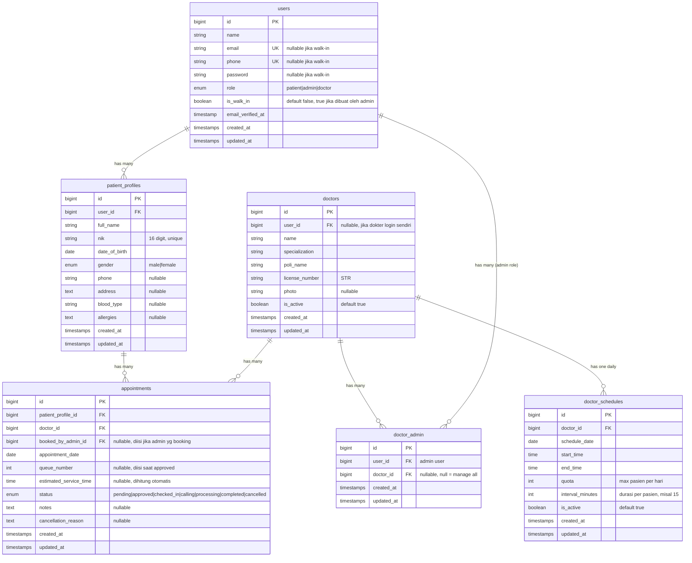
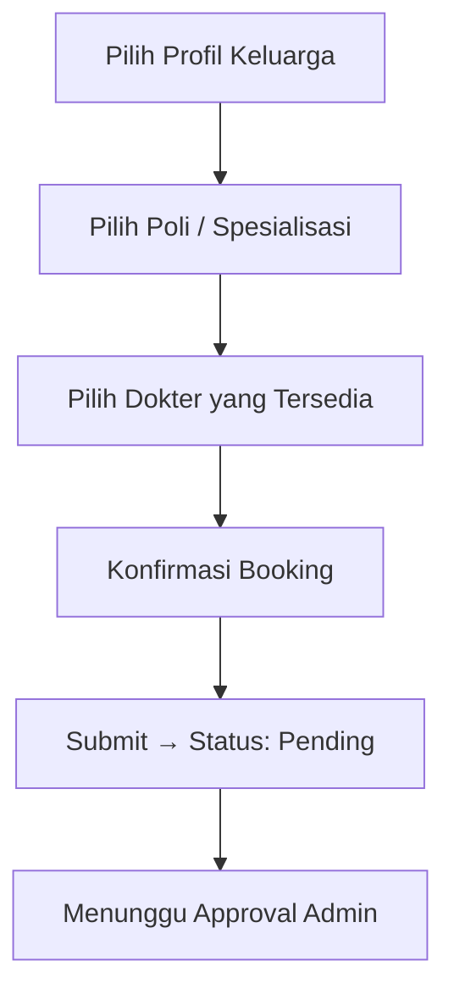
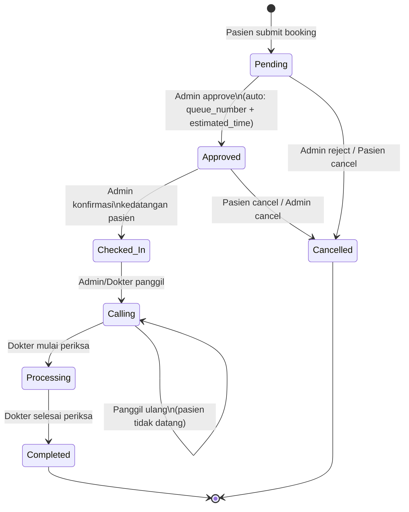

# 📋 Product Requirements Document (PRD)
# Aplikasi Manajemen Klinik Multi-Spesialis — Mobile-First Web App

---

## 1. Ringkasan Eksekutif

### 1.1 Nama Produk
**KlinikQ** — Mobile-First Multi-Specialist Clinic Management Web Application

### 1.2 Deskripsi Singkat
Aplikasi web berbasis Laravel, Livewire, dan Tailwind CSS untuk mengelola operasional klinik multi-spesialis. Aplikasi ini dirancang **mobile-first** dengan fokus pada kemudahan penggunaan via sentuhan jempol (*thumb-driven*), mendukung manajemen antrian real-time, booking janji temu, dan tampilan TV display untuk panggilan pasien.

### 1.3 Masalah yang Diselesaikan

| Masalah | Solusi |
|---------|--------|
| Pasien harus datang pagi-pagi dan mengantre manual | Booking online hari-H, estimasi waktu layanan otomatis |
| Satu akun hanya untuk satu orang | Satu akun bisa kelola banyak profil keluarga (anak, lansia) |
| Admin kesulitan mengelola kuota & jadwal dokter | Konfigurasi kuota harian & interval layanan per dokter |
| Tidak ada informasi antrian real-time di ruang tunggu | TV Display real-time dengan polling otomatis |
| Data rekam medis tercampur antar anggota keluarga | Rekam medis terikat ke `patient_profile_id`, bukan `user_id` |

### 1.4 Target Pengguna
- **Pasien & Keluarga** — Orang tua yang mengelola janji temu anak/anggota keluarga
- **Admin Klinik** — Staff administrasi yang mengelola antrian dan jadwal dokter
- **Dokter** — Praktisi medis yang melihat daftar pasien hari ini
- **TV Display** — Layar di ruang tunggu untuk menampilkan nomor antrian

### 1.5 Bahasa
- **Kode sumber & database**: Bahasa Inggris
- **UI/Label/Tampilan**: Bahasa Indonesia (target pengguna orang Indonesia)

---

## 2. Tech Stack & Arsitektur

### 2.1 Technology Stack

| Layer | Teknologi |
|-------|-----------|
| **Backend Framework** | Laravel 12 (latest) |
| **Frontend Reactivity** | Livewire 3 |
| **CSS Framework** | Tailwind CSS 3 |
| **Database** | MySQL 8 / PostgreSQL 15 |
| **Authentication** | Laravel Breeze (custom) |
| **Real-time (simulated)** | Livewire polling (`wire:poll.3s`) |
| **Server** | PHP 8.4+, Nginx/Apache |

### 2.2 Prinsip Arsitektur

- **Mobile-First Responsive Design** — Desain utama untuk layar < 640px, lalu scale up ke tablet & desktop
- **Custom UI 100%** — Tidak menggunakan Filament atau admin dashboard pre-built
- **Clean Code & DRY** — Reusable Livewire components, Blade partials, dan service classes
- **Separation of Concerns** — Business logic di Service/Action classes, bukan di Controller/Livewire component

---

## 3. Design System & UI/UX Guidelines

### 3.1 Color Palette

| Peran Warna | Nama | Hex Code | Penggunaan |
|-------------|------|----------|------------|
| Canvas/Background | Off-White / Putih Tulang | `#F8F7F3` | Background utama semua halaman |
| Primary | Mint/Teal | `#96E6C2` | Tombol utama, header, navigasi aktif, aksen |
| Urgency | Orange | `#EA580C` | Badge antrian, alert, status mendesak |
| Success/Approved | Amber/Gold | `#FFAA29` | Status disetujui, konfirmasi, badge sukses |
| Text Primary | Dark Charcoal | `#1F2937` | Teks utama / heading |
| Text Secondary | Gray | `#6B7280` | Teks pendukung / subtitle |
| Surface/Card | White | `#FFFFFF` | Card containers, modals |
| Danger | Red | `#DC2626` | Tombol batal, status cancelled |

### 3.2 Typography
- **Font Utama**: Inter (Google Fonts)
- **Heading**: Semi-bold / Bold
- **Body**: Regular (400)
- **Ukuran minimum touch target**: 44px × 44px (WCAG compliance)

### 3.3 Layout Strategy

| Device | Lebar | Layout |
|--------|-------|--------|
| Mobile (Pasien/Admin) | < 768px | Bottom Navigation Bar + Full-width content |
| Tablet (Dokter/Admin) | 768px — 1024px | Side Navigation + Main content area |
| Desktop (Admin/Dokter) | > 1024px | Side Navigation + Expanded workspace |
| TV Display | Fullscreen | Split layout (kiri: nomor aktif, kanan: daftar antrian) |

### 3.4 Navigasi

#### Bottom Navigation Bar (Mobile — Pasien)
```
┌──────────────────────────────────────────┐
│  🏠 Beranda  │  📋 Riwayat  │  👤 Profil │
└──────────────────────────────────────────┘
```

#### Bottom Navigation Bar (Mobile — Admin)
```
┌───────────────────────────────────────────────────┐
│  📥 Antrian  │  ⚙️ Pengaturan  │  👤 Akun        │
└───────────────────────────────────────────────────┘
```

#### Side Navigation (Tablet/Desktop — Dokter)
```
┌─────────────┬────────────────────────────┐
│ Logo        │                            │
│ Dashboard   │     Main Content Area      │
│ Pasien Hari │                            │
│ Ini         │                            │
│ Riwayat     │                            │
│ Profil      │                            │
└─────────────┴────────────────────────────┘
```

---

## 4. Arsitektur Database

### 4.1 Entity Relationship Diagram (ERD)


```mermaid
erDiagram
    users ||--o{ patient_profiles : "has many"
    users ||--o{ doctor_admin : "has many (admin role)"
    doctors ||--o{ doctor_admin : "has many"
    doctors ||--o{ appointments : "has many"
    doctors ||--o{ doctor_schedules : "has one daily"
    patient_profiles ||--o{ appointments : "has many"

    users {
        bigint id PK
        string name
        string email UK "nullable jika walk-in"
        string phone UK "nullable jika walk-in"
        string password "nullable jika walk-in"
        enum role "patient|admin|doctor"
        boolean is_walk_in "default false, true jika dibuat oleh admin"
        timestamp email_verified_at
        timestamps created_at
        timestamps updated_at
    }

    patient_profiles {
        bigint id PK
        bigint user_id FK
        string full_name
        string nik "16 digit, unique"
        date date_of_birth
        enum gender "male|female"
        string phone "nullable"
        text address "nullable"
        string blood_type "nullable"
        text allergies "nullable"
        timestamps created_at
        timestamps updated_at
    }

    doctors {
        bigint id PK
        bigint user_id FK "nullable, jika dokter login sendiri"
        string name
        string specialization
        string poli_name
        string license_number "STR"
        string photo "nullable"
        boolean is_active "default true"
        timestamps created_at
        timestamps updated_at
    }

    doctor_admin {
        bigint id PK
        bigint user_id FK "admin user"
        bigint doctor_id FK "nullable, null = manage all"
        timestamps created_at
        timestamps updated_at
    }

    doctor_schedules {
        bigint id PK
        bigint doctor_id FK
        date schedule_date
        time start_time
        time end_time
        int quota "max pasien per hari"
        int interval_minutes "durasi per pasien, misal 15"
        boolean is_active "default true"
        timestamps created_at
        timestamps updated_at
    }

    appointments {
        bigint id PK
        bigint patient_profile_id FK
        bigint doctor_id FK
        bigint booked_by_admin_id FK "nullable, diisi jika admin yg booking"
        date appointment_date
        int queue_number "nullable, diisi saat approved"
        time estimated_service_time "nullable, dihitung otomatis"
        enum status "pending|approved|checked_in|calling|processing|completed|cancelled"
        text notes "nullable"
        text cancellation_reason "nullable"
        timestamps created_at
        timestamps updated_at
    }
```

### 4.2 Aturan Bisnis Database

> [!IMPORTANT]
> **Aturan Kritis**: Semua rekam medis dan appointment HARUS terikat ke `patient_profile_id`, BUKAN `user_id`. Ini memungkinkan satu akun orang tua mengelola riwayat medis independen untuk beberapa anak atau kerabat.

- **Foreign Key Cascading**:
  - `patient_profiles.user_id` → ON DELETE CASCADE
  - `appointments.patient_profile_id` → ON DELETE RESTRICT (jangan hapus profil yang punya appointment)
  - `appointments.doctor_id` → ON DELETE RESTRICT
  - `doctor_admin.user_id` → ON DELETE CASCADE
  - `doctor_admin.doctor_id` → ON DELETE CASCADE
  - `doctor_schedules.doctor_id` → ON DELETE CASCADE

- **Unique Constraints**:
  - `patient_profiles.nik` — UNIQUE
  - `users.email` — UNIQUE
  - `users.phone` — UNIQUE
  - `doctor_schedules` — UNIQUE on (`doctor_id`, `schedule_date`)
  - `appointments` — UNIQUE on (`patient_profile_id`, `doctor_id`, `appointment_date`) → satu profil hanya bisa booking 1x ke dokter yang sama per hari

---

## 5. User Roles & Hak Akses

### 5.1 Definisi Role

| Role | Deskripsi | Akses |
|------|-----------|-------|
| **patient** | Kepala keluarga / pengguna individual | Kelola profil keluarga, booking appointment, lihat riwayat |
| **admin** | Staff administrasi klinik | Kelola antrian, approve/reject booking, konfigurasi jadwal dokter |
| **doctor** | Dokter praktik | Lihat daftar pasien hari ini, update status pasien |

### 5.2 Permission Matrix

| Fitur | Patient | Admin | Doctor |
|-------|:-------:|:-----:|:------:|
| Login/Register | ✅ | ✅ | ✅ |
| Kelola profil keluarga | ✅ | ❌ | ❌ |
| Booking appointment (sendiri) | ✅ | ❌ | ❌ |
| Booking appointment (atas nama pasien walk-in) | ❌ | ✅ | ❌ |
| Lihat riwayat sendiri | ✅ | ❌ | ❌ |
| Lihat daftar antrian | ❌ | ✅ | ✅ |
| Lihat antrian masuk (pending) | ❌ | ✅ | ❌ |
| Approve/Reject booking | ❌ | ✅ | ❌ |
| Konfigurasi jadwal & kuota dokter | ❌ | ✅ | ❌ |
| Panggil pasien (Calling) | ❌ | ✅ | ✅ |
| Update status ke Processing/Completed | ❌ | ❌ | ✅ |
| Lihat daftar pasien hari ini | ❌ | ✅ | ✅ |
| Akses TV Display | 🌐 Public | 🌐 Public | 🌐 Public |

### 5.3 Admin ↔ Doctor Assignment Rules

```
┌─────────────────────────────────────────────────────┐
│ doctor_admin.doctor_id = NULL                       │
│ → Admin ini bisa mengelola SEMUA dokter             │
│                                                     │
│ doctor_admin.doctor_id = 5                          │
│ → Admin ini hanya bisa mengelola Dokter ID 5        │
│                                                     │
│ Satu admin bisa punya banyak record doctor_admin    │
│ → Bisa mengelola beberapa dokter tertentu            │
└─────────────────────────────────────────────────────┘
```

---

## 6. Fitur Detail — Phase 1

### 6.1 Modul Autentikasi

#### 6.1.1 Registrasi Pasien
- **URL**: `/register`
- **Fields**:
  - Nama Lengkap (required, min: 3)
  - Email (required, unique, valid email)
  - No. Telepon (required, unique, format: 08xxxxxxxxxx)
  - Password (required, min: 8, confirmation)
- **Post-Registration**: Redirect ke halaman buat profil pasien pertama
- **UI**: Form sederhana, mobile-friendly, satu kolom

#### 6.1.2 Login
- **URL**: `/login`
- **Fields**: Email/No. Telepon + Password
- **Post-Login Redirect**:
  - Role `patient` → `/patient/dashboard`
  - Role `admin` → `/admin/dashboard`
  - Role `doctor` → `/doctor/dashboard`

#### 6.1.3 Logout
- Destroy session, redirect ke `/login`

---

### 6.2 Panel Pasien (Mobile-First)

#### 6.2.1 Dashboard Pasien
- **URL**: `/patient/dashboard`
- **Layout**: Bottom Navigation Bar (Beranda, Riwayat, Profil)
- **Komponen**:
  1. **Profile Picker (Netflix-Style)**
     - Tampilkan semua `patient_profiles` milik user dalam grid avatar
     - Setiap avatar: inisial nama + warna unik
     - Klik avatar = set profil aktif (simpan di session)
     - Tombol "+" untuk tambah profil baru
  2. **Status Antrian Aktif** (jika ada)
     - Card menampilkan: Nomor antrian, Dokter, Estimasi waktu
     - Warna card mengikuti status (orange = menunggu, hijau = sudah dipanggil)
  3. **Quick Actions**
     - Tombol besar "📅 Daftar Periksa" → ke flow booking
  4. **Info Klinik**
     - Jam operasional, alamat singkat

#### 6.2.2 Profil Keluarga — CRUD
- **URL**: `/patient/profiles`
- **Tambah Profil** (`/patient/profiles/create`):
  - Nama Lengkap (required)
  - NIK (required, 16 digit, unique, validasi format)
  - Tanggal Lahir (required, date picker)
  - Jenis Kelamin (required, pilihan: Laki-laki / Perempuan)
  - No. Telepon (opsional)
  - Alamat (opsional)
  - Golongan Darah (opsional, pilihan: A, B, AB, O)
  - Alergi (opsional, textarea)
- **Edit Profil**: Same form, pre-filled
- **Hapus Profil**: Soft confirmation dialog. Dilarang hapus jika ada appointment aktif.

#### 6.2.3 Booking Appointment (Flow Multi-Step)

**Step-by-step flow:**


```mermaid
flowchart TD
    A["Pilih Profil Keluarga"] --> B["Pilih Poli / Spesialisasi"]
    B --> C["Pilih Dokter yang Tersedia"]
    C --> D["Konfirmasi Booking"]
    D --> E["Submit → Status: Pending"]
    E --> F["Menunggu Approval Admin"]
```

**Step 1 — Pilih Profil**
- Tampilkan list profil keluarga (avatar + nama)
- Jika hanya 1 profil, auto-select

**Step 2 — Pilih Poli/Spesialisasi**
- Tampilkan card grid spesialisasi yang tersedia hari ini:
  - 🧒 Anak (Pediatrics)
  - 🤰 Kandungan (Obgyn)
  - 👂 THT (ENT)
  - 🫀 Penyakit Dalam (Internal Medicine)
  - 🧴 Kulit & Kelamin (Dermatology)
- Hanya tampilkan poli yang ada dokter aktif & jadwal hari ini

**Step 3 — Pilih Dokter**
- List dokter di poli tersebut yang buka hari ini
- Info: Nama, foto, sisa kuota hari ini
- Jika kuota penuh → tampilkan badge "Kuota Penuh", disable selection

**Step 4 — Konfirmasi**
- Summary: Profil pasien, Dokter, Tanggal (hari ini)
- Tombol "Daftar Sekarang"

**Validasi**:
- Satu profil hanya bisa booking 1x ke dokter yang sama per hari
- Booking hanya untuk hari ini (Hari-H), tidak bisa booking ke depan di Phase 1
- Kuota dokter belum penuh

#### 6.2.4 Riwayat Appointment
- **URL**: `/patient/history`
- Tampilkan semua appointment untuk SEMUA profil keluarga
- Filter by: Profil, Status, Tanggal
- Card per appointment: Nama pasien, Dokter, Tanggal, Status (badge warna), Nomor antrian

---

### 6.3 Panel Admin (Mobile & Tablet)

#### 6.3.1 Dashboard Admin
- **URL**: `/admin/dashboard`
- **Komponen**:
  1. **Summary Cards**:
     - Jumlah Pending hari ini (orange badge)
     - Jumlah Approved hari ini
     - Jumlah Completed hari ini
     - Total pasien hari ini
  2. **Quick Filter**: Filter by dokter (jika admin mengelola >1 dokter)

#### 6.3.2 Booking oleh Admin (Walk-in / Atas Nama Pasien)

> [!IMPORTANT]
> Fitur ini digunakan untuk pasien yang datang langsung ke klinik dan belum familiar menggunakan aplikasi. Admin membuat booking **atas nama pasien**, namun idealnya pasien tetap diarahkan untuk membuat akun sendiri di kemudian hari.

**URL**: `/admin/walk-in-booking`

**Alur**:
1. Admin mencari pasien berdasarkan NIK atau Nama
   - Jika **ditemukan**: Pilih profil pasien yang sudah ada
   - Jika **belum terdaftar**: Admin buat profil pasien baru (quick form: Nama, NIK, Tanggal Lahir, Jenis Kelamin)
     - Sistem otomatis membuat `user` account placeholder (tanpa password, ditandai `is_walk_in = true`)
     - Pasien bisa klaim akun ini nanti via registrasi dengan NIK yang sama
2. Admin pilih Dokter/Poli yang tersedia hari ini
3. Admin submit booking → Status langsung **Approved** (skip Pending, karena admin yang membuat)
4. Sistem otomatis hitung queue number & estimated time

**Catatan**: Appointment yang dibuat oleh admin ditandai dengan field `booked_by_admin_id` agar bisa dilacak.

---

#### 6.3.3 Manajemen Antrian

**URL**: `/admin/queue`

**Tabs / Filter Status**:
- 📥 Pending (baru masuk, butuh approval)
- ✅ Approved (sudah disetujui, menunggu kedatangan)
- 📍 Checked-In (pasien sudah di klinik)
- 📢 Calling (sedang dipanggil)
- 🔄 Processing (sedang diperiksa)
- ✔️ Completed (selesai)
- ❌ Cancelled (dibatalkan)

**Aksi per Card Antrian**:

| Status Saat Ini | Aksi yang Tersedia | Status Selanjutnya |
|-----------------|-------------------|--------------------|
| Pending | Approve, Reject | Approved / Cancelled |
| Approved | Check-In, Cancel | Checked-In / Cancelled |
| Checked-In | Panggil | Calling |
| Calling | Mulai Periksa, Panggil Ulang | Processing / Calling |
| Processing | Selesai | Completed |
| Completed | — (final state) | — |
| Cancelled | — (final state) | — |

**Logika Auto-Calculate saat Approve**:

> [!IMPORTANT]
> Ketika admin menekan tombol **"Approve"**, sistem WAJIB otomatis menghitung:
> 1. **Queue Number** — Nomor urut sekuensial berdasarkan jumlah appointment yang sudah di-approve untuk dokter tersebut pada hari itu + 1
> 2. **Estimated Service Time** — Dihitung berdasarkan: `doctor_schedule.start_time + (queue_number - 1) × doctor_schedule.interval_minutes`

**Contoh Kalkulasi**:
```
Dokter: dr. Andi (Anak)
Jadwal: 09:00 - 12:00, Interval: 15 menit, Kuota: 12

Pasien 1 di-approve → Queue #1, Estimasi: 09:00
Pasien 2 di-approve → Queue #2, Estimasi: 09:15
Pasien 3 di-approve → Queue #3, Estimasi: 09:30
...
Pasien 12 di-approve → Queue #12, Estimasi: 11:45
Pasien 13 coba booking → DITOLAK (kuota penuh)
```

#### 6.3.4 Konfigurasi Jadwal Dokter

**URL**: `/admin/doctors/{doctor}/schedule`

**Form Fields**:
- Tanggal Jadwal (default: hari ini)
- Jam Mulai Praktik (time picker, e.g., 09:00)
- Jam Selesai Praktik (time picker, e.g., 12:00)
- Kuota Pasien Harian (number input, e.g., 12)
- Interval per Pasien (select: 10 / 15 / 20 / 30 menit)
- Status Aktif (toggle on/off)

**Validasi**:
- `end_time` harus setelah `start_time`
- `quota × interval_minutes` tidak boleh melebihi durasi praktik (`end_time - start_time`)
- Tidak boleh ada duplikat jadwal untuk dokter + tanggal yang sama

---

### 6.4 TV Queue Display

#### 6.4.1 Spesifikasi Layar

- **URL**: `/tv-display` (public, tanpa login)
- **Parameter**: `/tv-display?doctor_id=1` (opsional, filter per dokter)
- **Layout**: Fullscreen, tanpa navigasi, auto-refresh

```
┌─────────────────────────────────────────────────────────────┐
│                     KLINIK [NAMA KLINIK]                    │
│                     📅 Rabu, 25 Juni 2026                    │
├───────────────────────────────────┬─────────────────────────┤
│                                   │   ANTRIAN SELANJUTNYA   │
│   SEDANG DIPANGGIL                │                         │
│                                   │  ┌───┬──────┬────────┐  │
│   ┌─────────────────────┐        │  │ # │ Nama │ Status │  │
│   │                     │        │  ├───┼──────┼────────┤  │
│   │    NOMOR ANTRIAN    │        │  │ 4 │ Budi │ ✅     │  │
│   │                     │        │  │ 5 │ Siti │ ✅     │  │
│   │       ██ 3 ██       │        │  │ 6 │ Dian │ 📍     │  │
│   │                     │        │  │ 7 │ Rudi │ ✅     │  │
│   │  dr. Andi - Anak    │        │  │ 8 │ Lina │ ✅     │  │
│   │  Ruang Periksa 1    │        │  └───┴──────┴────────┘  │
│   │                     │        │                         │
│   └─────────────────────┘        │                         │
│                                   │                         │
├───────────────────────────────────┴─────────────────────────┤
│            ⏰ Jam: 09:32  |  Pasien Hari Ini: 12           │
└─────────────────────────────────────────────────────────────┘
```

#### 6.4.2 Technical Requirements
- **Refresh**: Livewire polling setiap 3 detik (`wire:poll.3s`)
- **Tanpa WebSocket** — cukup polling ringan
- **Visual**:
  - Nomor antrian aktif: font besar (> 120px), warna orange `#EA580C`
  - Background gelap untuk kontras di ruang tunggu
  - Animasi pulse pada nomor yang sedang dipanggil
  - Daftar antrian berikutnya: 5–10 nomor terdekat

---

### 6.5 Panel Dokter (Tablet/Desktop — Phase 1 Basic)

#### 6.5.1 Dashboard Dokter
- **URL**: `/doctor/dashboard`
- **Layout**: Side navigation
- **Komponen**:
  1. Summary hari ini: Total pasien, Sudah diperiksa, Belum diperiksa
  2. Daftar pasien hari ini (sorted by queue_number)
  3. Tombol aksi: "Panggil Selanjutnya" → update status ke Calling

#### 6.5.2 Daftar Antrian (View-Only untuk Dokter)
- **URL**: `/doctor/queue`
- **Deskripsi**: Dokter bisa melihat seluruh daftar antrian hari ini untuk poli-nya
- **Tampilan**:
  - Tabel/list antrian dengan kolom: No. Antrian, Nama Pasien, Status, Estimasi Waktu
  - Filter by status (Approved, Checked-In, Calling, Processing, Completed)
  - **Read-only** — Dokter tidak bisa approve/reject, hanya bisa melihat & memproses pasien yang sudah dipanggil
- **Aksi yang diizinkan**:
  - Panggil pasien (Checked-In → Calling)
  - Mulai periksa (Calling → Processing)
  - Selesai periksa (Processing → Completed)

---

## 7. State Machine — Alur Status Appointment


```mermaid
stateDiagram-v2
    [*] --> Pending : Pasien submit booking
    Pending --> Approved : Admin approve\n(auto: queue_number + estimated_time)
    Pending --> Cancelled : Admin reject / Pasien cancel
    Approved --> Checked_In : Admin konfirmasi\nkedatangan pasien
    Approved --> Cancelled : Pasien cancel / Admin cancel
    Checked_In --> Calling : Admin/Dokter panggil
    Calling --> Processing : Dokter mulai periksa
    Calling --> Calling : Panggil ulang\n(pasien tidak datang)
    Processing --> Completed : Dokter selesai periksa
    Completed --> [*]
    Cancelled --> [*]
```

> [!WARNING]
> Status `Completed` dan `Cancelled` adalah **final states** — tidak bisa diubah kembali.

---

## 8. Routing Structure

### 8.1 Public Routes

| Method | URI | Deskripsi |
|--------|-----|-----------|
| GET | `/` | Landing page / redirect ke login |
| GET | `/login` | Halaman login |
| POST | `/login` | Proses login |
| GET | `/register` | Halaman registrasi pasien |
| POST | `/register` | Proses registrasi |
| POST | `/logout` | Proses logout |
| GET | `/tv-display` | TV Queue Display (public) |

### 8.2 Patient Routes (middleware: `auth`, `role:patient`)

| Method | URI | Deskripsi |
|--------|-----|-----------|
| GET | `/patient/dashboard` | Dashboard pasien |
| GET | `/patient/profiles` | Daftar profil keluarga |
| GET | `/patient/profiles/create` | Form tambah profil |
| GET | `/patient/profiles/{id}/edit` | Form edit profil |
| GET | `/patient/booking` | Flow booking appointment |
| GET | `/patient/history` | Riwayat appointment |

### 8.3 Admin Routes (middleware: `auth`, `role:admin`)

| Method | URI | Deskripsi |
|--------|-----|-----------|
| GET | `/admin/dashboard` | Dashboard admin |
| GET | `/admin/queue` | Manajemen antrian |
| GET | `/admin/walk-in-booking` | Booking atas nama pasien walk-in |
| GET | `/admin/doctors` | Daftar dokter yang dikelola |
| GET | `/admin/doctors/{id}/schedule` | Konfigurasi jadwal dokter |

### 8.4 Doctor Routes (middleware: `auth`, `role:doctor`)

| Method | URI | Deskripsi |
|--------|-----|-----------|
| GET | `/doctor/dashboard` | Dashboard dokter |
| GET | `/doctor/queue` | Daftar antrian hari ini (view + proses) |
| GET | `/doctor/patients-today` | Daftar pasien hari ini |

---

## 9. Validasi & Business Rules

### 9.1 Validasi Input

| Field | Rules |
|-------|-------|
| `name` | required, string, min:3, max:100 |
| `email` | required, email, unique:users |
| `phone` | required, regex:`/^08[0-9]{8,13}$/`, unique:users |
| `password` | required, min:8, confirmed |
| `nik` | required, digits:16, unique:patient_profiles |
| `date_of_birth` | required, date, before:today |
| `gender` | required, in:male,female |
| `blood_type` | nullable, in:A,B,AB,O |
| `start_time` | required, date_format:H:i |
| `end_time` | required, date_format:H:i, after:start_time |
| `quota` | required, integer, min:1, max:100 |
| `interval_minutes` | required, in:10,15,20,30 |

### 9.2 Business Rules

1. **Booking hanya untuk hari ini (Hari-H)** — Tidak ada fitur booking untuk hari depan di Phase 1
2. **Satu profil, satu dokter, satu hari** — Unique constraint: `(patient_profile_id, doctor_id, appointment_date)`
3. **Kuota otomatis terhitung** — Booking ditolak jika approved count >= quota pada jadwal dokter hari itu
4. **Queue number sequential** — Nomor urut dihitung dari jumlah appointment yang sudah approved + 1
5. **Estimated time auto-calculated** — `start_time + (queue_number - 1) × interval_minutes`
6. **Profil tidak bisa dihapus** jika ada appointment dengan status selain `completed` atau `cancelled`
7. **Admin scope** — Admin dengan `doctor_admin.doctor_id = NULL` bisa akses semua dokter; yang spesifik hanya bisa akses dokter yang di-assign

---

## 10. Seed Data (Pre-loaded untuk Testing)

### 10.1 Dokter

| ID | Nama | Spesialisasi | Poli |
|----|------|-------------|------|
| 1 | dr. Andi Pratama, Sp.A | Pediatrics | Anak |
| 2 | dr. Sari Dewi, Sp.OG | Obgyn | Kandungan |
| 3 | dr. Budi Santoso, Sp.THT | ENT | THT |

### 10.2 Admin Users

| ID | Nama | Email | Manage |
|----|------|-------|--------|
| 1 | Admin Utama | admin@klinik.com | Semua dokter (`doctor_id = NULL`) |
| 2 | Admin Anak | admin.anak@klinik.com | Hanya dr. Andi (doctor_id = 1) |

### 10.3 Jadwal Default (Hari ini)

| Dokter | Mulai | Selesai | Kuota | Interval |
|--------|-------|---------|-------|----------|
| dr. Andi | 09:00 | 12:00 | 12 | 15 menit |
| dr. Sari | 09:00 | 12:00 | 10 | 15 menit |
| dr. Budi | 13:00 | 16:00 | 12 | 15 menit |

### 10.4 Sample Patient User

| Nama | Email | Password | Profil Keluarga |
|------|-------|----------|-----------------|
| Ibu Ratna | ratna@email.com | password | Ratna (ibu), Dika (anak 5th), Nenek Siti (lansia) |

---

## 11. Non-Functional Requirements

### 11.1 Performance
- Halaman load < 2 detik pada 3G
- Livewire polling tidak boleh membebani server (< 50ms per poll request)
- Optimistic UI updates untuk aksi admin

### 11.2 Security
- CSRF protection pada semua form
- Role-based middleware pada setiap route group
- Input sanitization & validation
- Password hashing (bcrypt)
- Rate limiting pada login attempts

### 11.3 Accessibility
- Touch target minimum 44px × 44px
- Kontras warna memenuhi WCAG AA
- Label dan placeholder pada semua form input
- Focus states yang jelas

### 11.4 Browser Support
- Chrome (mobile & desktop) — primary
- Safari (iOS) — primary
- Firefox — secondary
- Samsung Internet — secondary

---

## 12. Struktur File Project (Rekomendasi)

```
klinik/
├── app/
│   ├── Enums/
│   │   └── AppointmentStatus.php          # Enum untuk status appointment
│   ├── Http/
│   │   └── Middleware/
│   │       └── CheckRole.php              # Middleware cek role user
│   ├── Livewire/
│   │   ├── Auth/
│   │   │   ├── LoginForm.php
│   │   │   └── RegisterForm.php
│   │   ├── Patient/
│   │   │   ├── Dashboard.php
│   │   │   ├── ProfilePicker.php
│   │   │   ├── ProfileForm.php
│   │   │   ├── BookingWizard.php
│   │   │   └── AppointmentHistory.php
│   │   ├── Admin/
│   │   │   ├── Dashboard.php
│   │   │   ├── QueueManager.php
│   │   │   ├── DoctorScheduleForm.php
│   │   │   └── QueueCard.php
│   │   ├── Doctor/
│   │   │   ├── Dashboard.php
│   │   │   └── PatientList.php
│   │   └── TvDisplay/
│   │       └── QueueDisplay.php
│   ├── Models/
│   │   ├── User.php
│   │   ├── PatientProfile.php
│   │   ├── Doctor.php
│   │   ├── DoctorAdmin.php
│   │   ├── DoctorSchedule.php
│   │   └── Appointment.php
│   └── Services/
│       ├── QueueService.php               # Logika kalkulasi antrian
│       └── BookingService.php             # Logika booking & validasi
├── database/
│   ├── migrations/
│   │   ├── create_users_table.php
│   │   ├── create_patient_profiles_table.php
│   │   ├── create_doctors_table.php
│   │   ├── create_doctor_admin_table.php
│   │   ├── create_doctor_schedules_table.php
│   │   └── create_appointments_table.php
│   └── seeders/
│       ├── DatabaseSeeder.php
│       ├── DoctorSeeder.php
│       ├── AdminSeeder.php
│       ├── ScheduleSeeder.php
│       └── PatientSeeder.php
├── resources/views/
│   ├── layouts/
│   │   ├── app.blade.php                  # Layout utama
│   │   ├── patient.blade.php              # Layout mobile pasien + bottom nav
│   │   ├── admin.blade.php                # Layout admin + side/bottom nav
│   │   ├── doctor.blade.php               # Layout dokter + side nav
│   │   └── tv.blade.php                   # Layout fullscreen TV
│   ├── livewire/
│   │   ├── auth/
│   │   ├── patient/
│   │   ├── admin/
│   │   ├── doctor/
│   │   └── tv-display/
│   └── components/
│       ├── bottom-nav.blade.php
│       ├── side-nav.blade.php
│       ├── status-badge.blade.php
│       └── profile-avatar.blade.php
└── routes/
    └── web.php
```

---

## 13. Fase Pengembangan

### Phase 1 — Core Engine 🟡 IN PROGRESS (~65% Complete)

**Update Status (2026-07-05 10:17 WIB)**: Core infrastructure (DB, Models, Seeders) 100% selesai. Livewire components ~75% done (14 components, beberapa masih stub). Blade layouts 4/6 dibuat (doctor & tv belum ada). Services/Enums layer belum dibuat. Testing & polish belum dimulai.

| # | Modul | Prioritas | Estimasi | Status | Catatan |
|---|-------|-----------|----------|--------|---------|
| 1 | Setup project, database migrations, seeders (Poli, Rekam Medis, Obat) | P0 | 1 hari | ✅ **Selesai** | 12 tables, 15 migrations, 7 seeders |
| 2 | Autentikasi (Login/Logout) + Middleware + Base Dashboards | P0 | 1 hari | ✅ **Selesai** | LoginForm, RegisterForm, CheckRole middleware |
| 3 | Patient: Profile CRUD + Netflix picker | P0 | 1 hari | ✅ **Selesai** | ProfilePicker, ProfileForm + views |
| 4 | Patient: Booking wizard (multi-step) | P0 | 1-2 hari | ✅ **Selesai** | BookAppointment component (7.8KB) + view (18KB) |
| 5 | Admin: Queue management + Approve logic | P0 | 1-2 hari | ✅ **Selesai** | QueueManager (5.8KB) + view (15.6KB), auto queue calc |
| 6 | Admin: Doctor schedule config + services | P0 | 0.5 hari | ✅ **Selesai** | ScheduleManager + DoctorServiceManager components |
| 7 | TV Queue Display | P0 | 1 hari | ✅ **Selesai** | QueueDisplay component (2.5KB) + view (9.3KB), polling 3s |
| 8 | Doctor Dashboard | P1 | 0.5 hari | 🟡 **20%** | ⚠️ Component STUB saja (252 bytes) — nilai statis, tidak ada logic/data real |
| 8a | Patient: Appointment History | P1 | 0.5 hari | ❌ **0%** | Component belum ada (tidak ada AppointmentHistory.php) |
| 8b | Admin: Walk-in booking flow | P1 | 1 hari | ❌ **0%** | Belum ada UI atau component khusus walk-in |
| 8c | Doctor: Patient list + medical records | P1 | 1 hari | ❌ **0%** | Model MedicalRecord ada, tapi Doctor/PatientList & MedicalRecordForm belum dibuat |
| 9 | Blade layouts & components | P0 | 1.5 hari | 🟡 **50%** | 4/6 layouts ada (app✅, admin✅, auth✅, patient✅, ❌doctor, ❌tv). 2 blade components (bottom-nav, admin-nav-item) |
| 10 | Service/Enum layer | P1 | 0.5 hari | ❌ **0%** | Tidak ada app/Services/ atau app/Enums/ directory |
| 11 | Tailwind CSS styling & UI polish | P0 | 2-3 hari | 🟡 **40%** | Admin views sudah styled (Tailwind CDN/Vite). Beberapa view sudah polished. |
| 12 | Testing (unit + integration) | P0 | 2 hari | ❌ **0%** | Belum ada test files |
| 13 | Bug fixes & optimization | P0 | 1 hari | ❌ **0%** | Belum dimulai |

**Estimasi Total Phase 1: ~7-10 hari kerja** | **Selesai: ~33/51 jam (~65%)** | **Sisa: ~18 jam**

**✅ Key Achievements (Yang Sudah Ada di Codebase):**
- ✅ 11 Models (User, PatientProfile, Polyclinic, Doctor, DoctorSchedule, DoctorService, DoctorAdmin, Appointment, MedicalRecord, Medicine, Prescription)
- ✅ 15 migration files (semua tabel termasuk 3 tambahan 2026-07-05)
- ✅ 7 seeders (Database, Polyclinic, Doctor, Admin, Patient, Schedule, Medicine)
- ✅ 14 Livewire Components:
  - Auth: LoginForm, RegisterForm
  - Patient: Dashboard, ProfilePicker, ProfileForm, BookAppointment
  - Admin: Dashboard, QueueManager, PatientDatabase, DoctorList, ScheduleManager, DoctorServiceManager
  - Doctor: Dashboard (⚠️ stub)
  - TvDisplay: QueueDisplay
  - Apotek: Dashboard (stub), SuperAdmin: Dashboard (stub)
- ✅ 14 Blade views sesuai komponen Livewire
- ✅ 4 Layout files (app, admin, auth, patient)
- ✅ 2 Blade components (bottom-nav, admin-nav-item)
- ✅ Routes lengkap (patient, admin, doctor, apotek, super_admin, tv-display)
- ✅ CheckRole middleware
- ✅ CreateTestAppointments artisan command
- ✅ Queue calculation logic (di QueueManager)

**❌ Remaining Critical Tasks (Yang BELUM Ada di Codebase):**
1. ❌ Patient/AppointmentHistory — component & view belum ada
2. ❌ Admin walk-in booking — belum ada dedicated flow/UI
3. ❌ Doctor/PatientList — component & view belum ada
4. ❌ Doctor/MedicalRecordForm — component & view belum ada
5. ❌ Doctor Dashboard — perlu rebuild, saat ini cuma stub statis
6. ❌ `layouts/doctor.blade.php` — layout file belum ada
7. ❌ `layouts/tv.blade.php` — layout file belum ada (QueueDisplay pakai layouts.app)
8. ❌ app/Services/ (QueueService, BookingService) — belum dibuat
9. ❌ app/Enums/AppointmentStatus.php — belum dibuat
10. ❌ Reusable components (status-badge, profile-avatar, side-nav, form-input, modal) — sebagian besar belum
11. ❌ Unit/Feature tests — belum ada
12. ❌ Performance optimization — belum dimulai

### Phase 2 — Enhancements (Future)
- Booking untuk hari depan (advance booking) → 3 hari
- Notifikasi WhatsApp / SMS saat dipanggil → 2 hari
- Rekam medis (SOAP notes) oleh dokter → 2 hari
- Dashboard analytics & reporting → 3 hari
- Multi-branch klinik support → 4 hari
- Payment integration → 3 hari
- **Estimasi Phase 2: 17 hari**

### Phase 3 — Scale (Future)
- Mobile app (React Native / Flutter wrapper) → 10 hari
- WebSocket real-time (Pusher/Soketi) → 3 hari
- Telemedicine / video call → 5 hari
- Pharmacy & prescription management → 4 hari
- Insurance integration → 4 hari
- **Estimasi Phase 3: 26 hari**

**Timeline Keseluruhan:**
- Phase 1: 7-10 hari (CURRENT)
- Phase 2: 17 hari (Q3 2026)
- Phase 3: 26 hari (Q4 2026)
- **Total: ~50-53 hari kerja (~10 minggu)**

---

## 14. Rencana Verifikasi

## 14. Rencana Verifikasi

### 14.1 Pre-Testing Setup ✅ READY

```bash
# 1. Navigate to project
cd c:\laragon\www\klinik

# 2. Run migrations & seeders
php artisan migrate --fresh
php artisan db:seed

# 3. Create test appointments
php artisan appointments:create-test 15

# 4. Start dev server
php artisan serve

# 5. Test credentials
# Patient: ratna@email.com / password
# Admin: admin@klinik.com / password
# Doctor: Will be seeded
```

### 14.2 Automated Tests ⬜ TODO

```bash
# Run test suite
php artisan test

# Run specific test
php artisan test --filter=Booking
php artisan test --filter=Queue
```

### 14.3 Manual Testing Checklist — Core Features ⬜ TODO

#### Authentication Flow
- [ ] Register new patient account
- [ ] Verify email validation (format & uniqueness)
- [ ] Verify phone validation (format: 08xxxxxxxxxx, uniqueness)
- [ ] Verify password confirmation
- [ ] Login with email
- [ ] Login with phone number
- [ ] Logout functionality
- [ ] Role-based redirect (patient → /patient/dashboard, admin → /admin/dashboard)

#### Patient Module
- [ ] **Profile Management**
  - [ ] Create first profile on registration
  - [ ] View all family profiles in Netflix-style picker
  - [ ] Add new family profile with all fields
  - [ ] Edit existing profile
  - [ ] Delete profile (success & validation - cannot delete if appointments exist)
  - [ ] Set active profile via session
  - [ ] Verify NIK uniqueness & format (16 digits)

- [ ] **Dashboard**
  - [ ] View active profile with avatar
  - [ ] Display active appointment status (if any)
  - [ ] Quick action button to book appointment
  - [ ] View clinic info

- [ ] **Booking Wizard (5-Step Flow)**
  - [ ] Step 1: Profile selection (auto-select if only 1 profile)
  - [ ] Step 2: Polyclinic/Specialization selection
    - [ ] Only show active polyclinics with doctors available today
    - [ ] Display polyclinic names & icons
  - [ ] Step 3: Doctor selection
    - [ ] Show available doctors for selected polyclinic
    - [ ] Display remaining quota (if full, show "Kuota Penuh" badge)
    - [ ] Disable booking if quota full
  - [ ] Step 4: Service selection (if multiple services available)
  - [ ] Step 5: Complaint/notes input & confirmation
    - [ ] Display summary with profile, doctor, date
    - [ ] Submit & verify status = "pending"
  - [ ] Validation: Cannot book same doctor twice on same day
  - [ ] Validation: Cannot exceed doctor quota
  - [ ] Confirmation message on successful booking

- [ ] **Appointment History** (⬜ Not yet implemented)
  - [ ] View all appointments for all family profiles
  - [ ] Filter by profile, status, date
  - [ ] Pagination
  - [ ] Display status with color badges
  - [ ] Display queue number when approved

#### Admin Module
- [ ] **Dashboard**
  - [ ] View summary cards (pending, approved, completed today)
  - [ ] Display total patients for today
  - [ ] Doctor filter dropdown

- [ ] **Queue Management**
  - [ ] View appointments by tab (pending, approved, checked-in, calling, processing, completed)
  - [ ] **Pending Tab**: Display pending appointments
    - [ ] Approve action: Auto-calculate queue_number + estimated_time
    - [ ] Verify queue calculation logic: queue_number = max(previous) + 1
    - [ ] Verify estimated time: start_time + (queue_number - 1) × interval
    - [ ] Reject action: Change status to cancelled
  - [ ] **Approved Tab**: Display approved appointments
    - [ ] Check-in action: Change to checked_in status
    - [ ] Cancel action: Change to cancelled
  - [ ] **Checked-in Tab**: Display checked-in appointments
    - [ ] Call action: Change to calling status
  - [ ] **Calling Tab**: Display calling appointments
    - [ ] Start processing action: Change to processing
    - [ ] Call again action: Keep in calling
  - [ ] **Processing Tab**: Display in-process appointments
    - [ ] Complete action: Change to completed
  - [ ] **Completed Tab**: Display final appointments
  - [ ] Filter by date & doctor
  - [ ] Verify status flow is correct

- [ ] **Doctor Schedule Configuration** (🟡 Partially done - need UI)
  - [ ] View doctor's schedule
  - [ ] Edit schedule (time, quota, interval)
  - [ ] Validation: end_time > start_time
  - [ ] Validation: quota × interval <= duration
  - [ ] Toggle schedule active/inactive
  - [ ] No duplicate schedules for same doctor + date

- [ ] **Doctor Service Management** (🟡 Partially done - need UI)
  - [ ] View doctor's services
  - [ ] Add new service (name, description, duration, price)
  - [ ] Edit service
  - [ ] Delete service
  - [ ] Toggle service active/inactive

- [ ] **Patient Database** (🟡 Partially done - need UI)
  - [ ] Search patient by NIK
  - [ ] Search patient by name
  - [ ] Search patient by phone
  - [ ] View patient's appointment history
  - [ ] Quick walk-in booking option

- [ ] **Walk-in Booking Flow** (⬜ Not yet implemented)
  - [ ] Search for existing patient
  - [ ] Create new walk-in patient if not found
  - [ ] Auto-create user account with is_walk_in = true
  - [ ] Direct approve (skip pending status)
  - [ ] Auto-calculate queue number

#### Doctor Module
- [ ] **Dashboard**
  - [ ] View today's summary (total, completed, remaining)
  - [ ] View list of patients for today
  - [ ] Display current/calling patient info
  - [ ] Verify sorting by queue number

- [ ] **Patient List & Medical Records** (⬜ Not yet implemented)
  - [ ] View full queue with status
  - [ ] Filter by status
  - [ ] Call next button (change to calling)
  - [ ] Start processing button (change to processing)
  - [ ] Complete button (change to completed)
  - [ ] View patient profile & medical history
  - [ ] Add SOAP notes (Subjective, Objective, Assessment, Plan)
  - [ ] Create/recommend prescription

#### TV Display Module
- [ ] **Real-time Display**
  - [ ] Access /tv-display without login ✅
  - [ ] Display active appointment (large number) ✅
  - [ ] Display next 5-10 appointments ✅
  - [ ] Auto-refresh every 3 seconds (verify via Livewire polling) ✅
  - [ ] Update immediately when status changes ✅
  - [ ] Doctor filtering (via ?doctor_id=1) ✅
  - [ ] Display patient name & doctor name ✅
  - [ ] Show appropriate status colors

### 14.4 UI/UX Testing ⬜ TODO

#### Responsive Design
- [ ] **Mobile (iPhone SE - 375x667)**
  - [ ] Bottom navigation visible
  - [ ] Content readable (no horizontal scroll)
  - [ ] Buttons & inputs proper size (44px touch target)
  - [ ] Forms single column
  - [ ] Images scaled appropriately

- [ ] **Tablet (iPad - 1024x768)**
  - [ ] Side or mixed navigation
  - [ ] Content properly laid out
  - [ ] Proper spacing

- [ ] **Desktop (1920x1080)**
  - [ ] Full layout with sidebars
  - [ ] Proper use of screen space
  - [ ] No excessive whitespace

#### Accessibility
- [ ] Color contrast meets WCAG AA (4.5:1 for text)
- [ ] Touch targets minimum 44×44px
- [ ] Form labels & placeholders present
- [ ] Focus states clearly visible
- [ ] Keyboard navigation works

#### Visual Consistency
- [ ] Color palette applied (Mint, Orange, Gold, etc.)
- [ ] Typography consistent (Inter font)
- [ ] Spacing consistent (8px grid)
- [ ] Icons consistent style
- [ ] Status badges color-coded

### 14.5 Performance Testing ⬜ TODO

- [ ] Page load time < 2 seconds (3G network)
- [ ] Livewire polling response < 50ms
- [ ] No N+1 database queries
- [ ] Database indexes present
- [ ] Lazy loading for images
- [ ] Caching for static content

### 14.6 Integration Testing ⬜ TODO

#### End-to-End Workflows
- [ ] **Complete Patient Booking → Admin Approval → Doctor Processing**
  1. Patient registers & creates profile
  2. Patient books appointment (verify status = pending)
  3. Admin reviews pending appointment
  4. Admin approves (verify queue_number & estimated_time calculated)
  5. Admin check-in patient
  6. Admin calls patient (status = calling)
  7. Doctor starts processing (status = processing)
  8. Doctor completes (status = completed)
  9. TV Display shows correct queue throughout
  10. Patient history shows completed appointment

- [ ] **Quota & Booking Validation**
  1. Create doctor schedule with quota = 3
  2. Book 3 patients (all should succeed)
  3. Try to book 4th patient (should be rejected - quota full)
  4. Admin approves all 3 → queue numbers should be 1, 2, 3
  5. Estimated times should be: start + 0×15min, start + 1×15min, start + 2×15min

- [ ] **Admin Scope & Doctor Assignment**
  1. Global admin can see/manage all doctors
  2. Restricted admin can only see assigned doctor(s)
  3. Restricted admin cannot see other doctors' appointments

- [ ] **Walk-in Booking** (⬜ When implemented)
  1. Admin creates new walk-in patient
  2. User account auto-created with is_walk_in = true
  3. Appointment auto-approved
  4. Patient can later claim account via registration with same NIK

### 14.7 Security Testing ⬜ TODO

- [ ] CSRF tokens present on all forms
- [ ] Role-based middleware enforced
  - [ ] Patient cannot access /admin/queue
  - [ ] Admin cannot access /patient/book-appointment as different user
  - [ ] Doctor cannot modify appointments (read-only except status updates)
- [ ] Password not visible in network requests
- [ ] Session validation works
- [ ] Logout properly clears session

---

## 15. Open Questions

> [!IMPORTANT]
> Beberapa pertanyaan yang perlu dijawab sebelum mulai development:

1. **Nama Klinik**: Apa nama klinik yang akan ditampilkan di header & TV Display? Atau gunakan placeholder yang bisa dikonfigurasi?

2. **Registrasi Admin & Dokter**: Apakah admin dan dokter dibuat manual via seeder saja, atau perlu halaman registrasi/invitation khusus?

3. **Notifikasi Pasien**: Di Phase 1, apakah cukup notifikasi di dalam app (polling-based) saat pasien di-approve / dipanggil, atau belum perlu notifikasi sama sekali?

4. **Pembatalan oleh Pasien**: Apakah pasien bisa membatalkan booking sendiri, atau hanya admin yang bisa?

5. **Database**: Preferensi MySQL atau PostgreSQL?

6. **Multi-poli per dokter**: Apakah satu dokter bisa praktik di >1 poli, atau selalu 1 dokter = 1 poli?

7. **Jam operasional tetap atau dinamis**: Apakah jadwal dokter bisa berbeda tiap hari (sudah diakomodasi di `doctor_schedules` per tanggal), atau cukup jadwal mingguan tetap?
